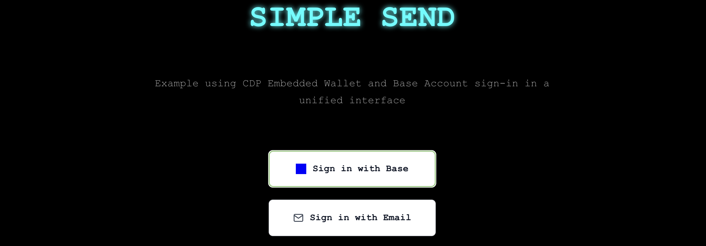

# simple send

A showcase application demonstrating unified Base Account and CDP Embedded Wallet integration on Base Sepolia.



## overview

Simple Send demonstrates how to build onchain apps that support existing Base users and newcomers through a unified auth interface.

**supported auth methods:**
- 🟦 **Base Account** - Passkey-based auth for existing Base users
- 📱 **CDP Embedded Wallet** - Email-based authentication for new users (you can add Mobile SMS auth if desired, and more Social OAuth methods are coming to CDP Embedded Wallet soon!)

**core features:**
- **connected wallet details** - top-right component indicates whether the connected wallet is a Base Account or Embedded Wallet, shows beginning & end of address, lets you copy the address & disconnect
- **balances** - view ETH and USDC holdings of the connected wallet using CDP Data APIs
- **faucet** - get ETH and USDC on Base Sepolia into the connected wallet, using CDP Faucet API  
- **send on Base Sepolia** - Transfer ETH or USDC to any address on Base Sepolia
- **ENS & Basename resolution** - Enter an ENS or Basename in the destination field

## details

### unified auth
- single interface supporting both wallet types
- automatic wallet persistence (users get existing wallets, not new ones)
- seamless switching between auth methods

### token management
- realtime balance checking using CDP Token Balances API
- faucet integration for getting Base Sepolia testnet tokens
- support for both ETH & USDC sends

### ENS resolution
- **ENS support** - Resolve .eth names (e.g., `vitalik.eth`)
- **Basename support** - Resolve .base.eth names (e.g., `jnix.base.eth`)
- **direct addresses** - Standard 0x addresses

## quickstart

### pre-reqs
- Node.js 18+
- CDP Portal account with Project ID
- Base Account (for testing Base Account flow)

### installation

1. **clone the repo**
   ```bash
   git clone https://github.com/jnix2007/simple-send.git
   cd simple-send
   npm install
   ```

2. **setup env variables**
   ```bash
   cp .env.example .env.local
   ```
   
   **edit `.env.local` with your stuff:**
   ```bash
   # CDP Configuration (get from https://portal.cdp.coinbase.com/)
   NEXT_PUBLIC_CDP_PROJECT_ID=your-cdp-project-id
   NEXT_PUBLIC_APP_NAME=Simple Send
   
   # CDP API Keys (for faucet and balance APIs)
   CDP_API_KEY_ID=your-api-key-id
   CDP_API_KEY_SECRET=your-api-key-secret
   ```

3. **configure domains (CORS) in CDP Portal**
   - go to [CDP Portal](https://portal.cdp.coinbase.com/) → Wallets → Embedded Wallet → Domains
   - add these domains to allowed origins so you can test locally:
     - `http://localhost:3000`
     - `http://localhost:3001`
     - `http://localhost:3002`

4. **start dev server**
   ```bash
   npm run dev
   ```

5. **open the app locally**
   - visit `http://localhost:3000` or whatever port your terminal says
   - try both auth methods out
   - faucet some testnet tokens
   - test sending transactions!

## architecture

### auth flow
- **Base Account**: Wagmi connector with passkey auth
- **Embedded Wallet**: CDP React provider with email OTP
- **unified hook**: `useUnifiedAuth` manages both wallet types

### txn handling
- **Base Account**: Wagmi `useSendTransaction` for ETH & USDC
- **Embedded Wallet**: CDP `useSendEvmTransaction` for ETH & USDC
- **routing**: uses the right method based on the connected wallet type

### API integration
- **balances**: CDP `listTokenBalances` for realtime balances on the connected wallet
- **faucet**: CDP `requestFaucet` for testnet tokens
- **ENS resolution**: ENS API

## Customization

### UI theme
went for a fun cyberpunk feel, using CSS custom properties, you can re-skin however you want:

```css
:root {
  --cyber-blue: #00ffff;    /* Primary color */
  --cyber-pink: #ff00ff;    /* Secondary color */  
  --cyber-green: #00ff00;   /* Accent color */
  --cyber-black: #000000;   /* Background */
}
```

### network config
defaults to Base Sepolia but you can switch to Base Mainnet if you want:

1. **update Wagmi config** (`src/config/wagmi.ts`):
   ```typescript
   import { base } from 'wagmi/chains';
   // Change chains: [baseSepolia] to chains: [base]
   ```

2. **update API calls** - Change `base-sepolia` to `base` in:
   - balance API route
   - transaction components
   - probably wanna replace faucet API route with Coinbase Onramp integration here

3. **update CA's** - Use mainnet USDC contract address instead of Base Sepolia

### adding features
you can add stuff like:
- **more tokens** - add token definitions & update the UI
- **more networks** - extend the Wagmi config

## repo file structure

```
src/
├── app/
│   ├── api/
│   │   ├── balances/route.ts    # CDP Token Balances API
│   │   └── faucet/route.ts      # CDP Faucet API
│   ├── globals.css              # Cyberpunk theme styles
│   ├── layout.tsx               # Provider setup
│   └── page.tsx                 # Main application
├── components/
│   ├── BalanceModal.tsx         # Token balance display
│   ├── SendTransaction.tsx      # Transaction interface
│   ├── TopNav.tsx               # Navigation with modals
│   └── WalletAuthButton.tsx     # Authentication UI
├── config/
│   └── wagmi.ts                 # Wagmi configuration
└── hooks/
    └── useUnifiedAuth.ts        # Unified authentication hook
```

## useful docs

- [Base Account + CDP Embedded Wallets Integration Guide](https://docs.base.org/base-account/framework-integrations/cdp)
- [Base Account docs](https://docs.base.org/base-account/)
- [Base Account Wagmi integration](https://docs.base.org/base-account/framework-integrations/wagmi/))
- [CDP Embedded Wallets docs](https://docs.cdp.coinbase.com/embedded-wallets/)
- [CDP React Hooks](https://docs.cdp.coinbase.com/embedded-wallets/hooks)

## license

MIT License - feel free to use this code as a starting point for your own projects.

---

**Base is for everyone 🟦 stay based**